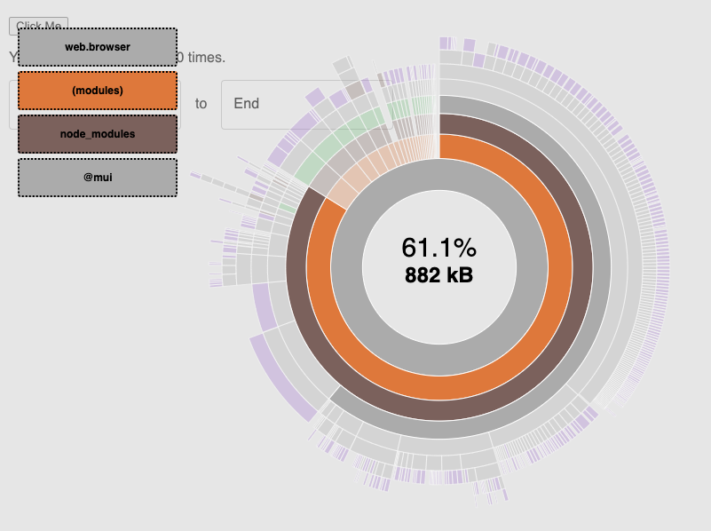

## Mui large bundle size

Get started:
* Install Meteor: https://docs.meteor.com/install.html
* Install node modules: `meteor npm i`

To start the bundle-visualizer, run `meteor npm run visualize`

### What the bundle looks like

The @mui packages represent 881KB of the bundle with only the DateRangePicker. Components such as AutoComplete, Slider, Rating, SwipeableDrawer, Badge, Grid, LinearProgress are all imported. Maybe some of them are actually used in the DateRangePicker, but all of them sounds weird to me.

